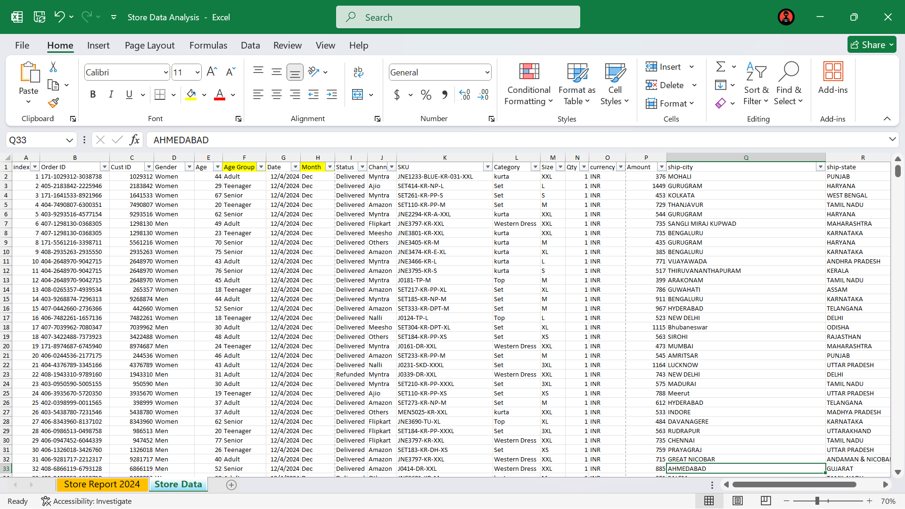

# Store-Data-Analysis-with-Excel
Excel data analysis project exploring the sales trend. Uses Pivot tables and charts for insights. Inspired by Rishabh Mishra's tutorial.

## Overview

This project was created using Microsoft Excel to perform data analysis on a given dataset. The analysis involved Data cleaning, Pivot tables, Pivot charts, Formulas, etc. The goal of this project was to analyze the store data and find the insights in order to make the store growing.

## Project Files

The repository contains the following files:

* `Store Data Analysis.xlsx`: This is the main Excel file containing the data and the analysis report.
* `README.md`: This file will provide the overview about the project.

## Tools Used

* Microsoft Excel

## Objective

A Store wants to create an annual sales report for 2024 so that it can understand customers and grow sales in 2025.

## Dataset Column Description

* **Cust ID:** A unique identifier for each customer.
* **Gender:** The gender of the customer.
* **Age:** The age of the customer in years.
* **Status:** The delivery status of the order (e.g., Delivered).
* **Channel:** The sales channel through which the order was placed (e.g., Myntra, Ajio, Amazon, Flipkart, Meesho, Others, Mall).
* **SKU:** Stock Keeping Unit - a unique identifier for each product.
* **Category:** The product category (e.g., Set, Kurta, Western Dress, Top).
* **Size:** The size of the product ordered (e.g., XXL, L, S, M, XL).
* **Qty:** The quantity of the product ordered.
* **Currency:** The currency in which the order was placed (INR - Indian Rupee).
* **Amount:** The total amount of the order.
* **ship-city:** The city to which the order was shipped.
* **ship-state:** The state to which the order was shipped.
* **ship-postal-code:** The postal code of the shipping address.
* **ship-country:** The country to which the order was shipped (IN - India).
* **B2B:** Indicates if the order was a Business-to-Business transaction (TRUE/FALSE).

## Questions

* Which Month got the highest sales and Orders ?
* Who purchased more men or women.
* Orders successfully done.
* Top 10 States contributing to Sales.
* Which Channel is contributing to the Sales ?
* Highest Selling Category.

## Sample Insights

** Women are more likely to buy compared to men (~65%).
** Maharashtra, Karnataka and Uttar Pradesh are top 3 states (~35%)
** Adult age group (30-49 yrs) is max contributing (~50%).
** Amazon, Flipkart and Myntra channels are max contributing (~80%)

## Final Conclusion to improve Sales

Target women customers of age group (30-49 yrs) that live in Maharashtra, Karnataka and Uttar Pradesh by showing ads/offers/coupon available on Amazon, Flipkart and Myntra
